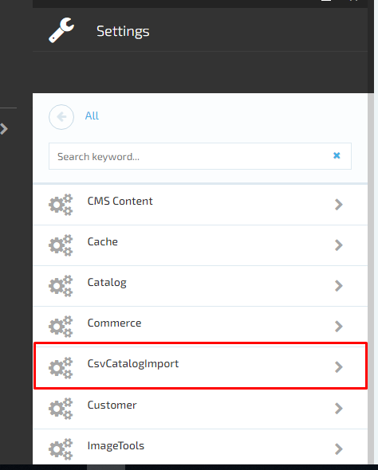
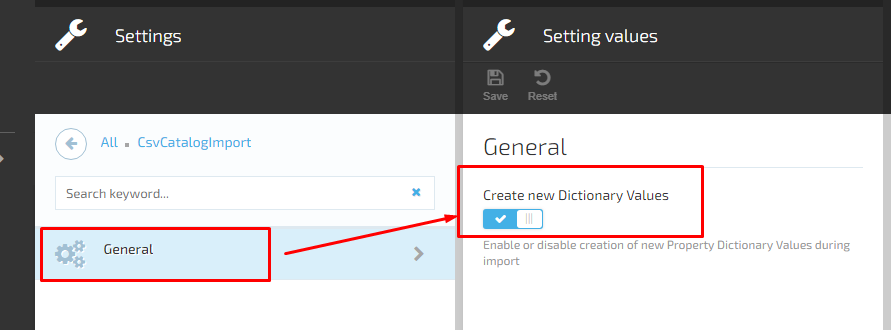
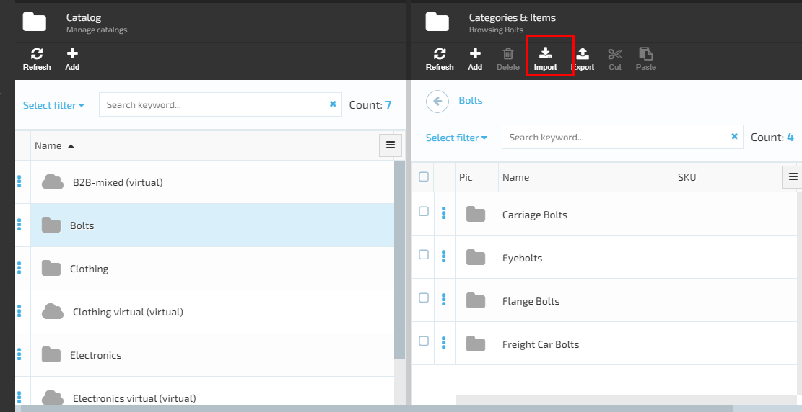
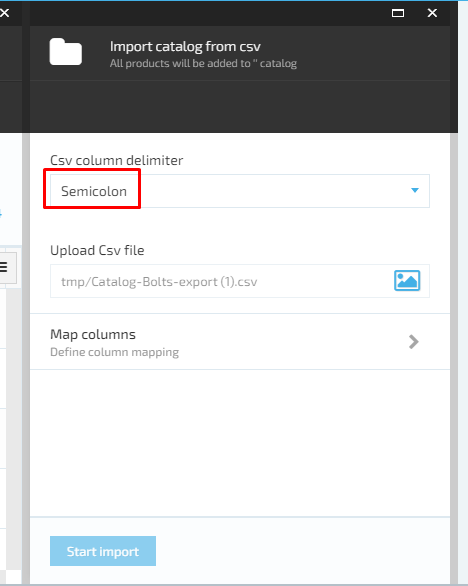
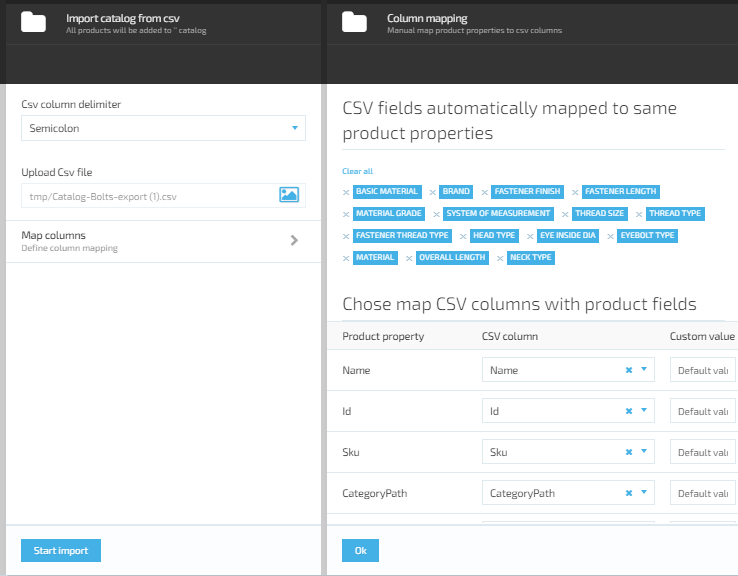
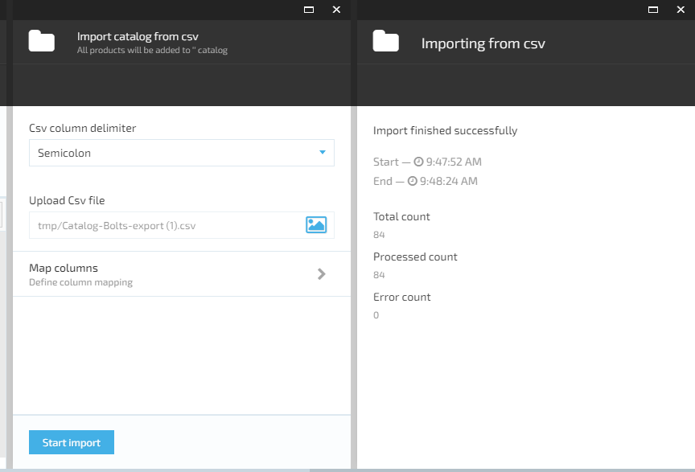

# Catalog CSV Import module

    

Catalog CSV Import module

# Installation
Installing the module:
* Automatically: in VC Manager go to Configuration -> Modules -> Catalog CSV Import module -> Install
* Manually: download module zip package from https://github.com/VirtoCommerce/vc-module-catalog-csv-import/releases. In VC Manager go to Configuration -> Modules -> Advanced -> upload module package -> Install.

# Settings

Before starting using the Import functionality, the admin should set the 'Create new dictionary values' for Import Module. In order to set this parameter, the user should go through the following steps:

1. Open Settings→select CSVCatalogImport→select General;
1. The system will open the 'Settings values' blade;
1. The user switches on  the 'Create new dictionary value' switch and saves the changes;  
1. The system will save the changes and enable creation of new Property Dictionary Values during data import.

## Catalog Import

### Scenario

1. The user opens Catalog module→ selects a Catalog and clicks 'Import';

1. The system will open the Import types blade and allows the user to select CSV import format;
1. The user opens the next blade.
The system will prompt the user to do the following:

     1. Select delimeter from drop down;
     1. Upload a CSV file;
     1. Map columns;

1. The user selects the delimeter, uploads the file and selects 'Map columns;

1. The system will display the next blade - Columns mapping;
1. The system automatically maps the CSV fields to to the same product properties;

1. The user confirms the mapping results by clicking the 'OK' button;
1. The system will display the 'Import catalog from csv' blade and the 'Start Import' button will become active;
1. The user starts the import by clicking the 'Start Import' button;
1. The import report will be generated by the system once the import is completed;
1. The Import report should display the following information:

## Model Mappings
### Seo Info
|CSV Property Name |Model Property Name|
|------------------|-------------------|
|SeoUrl|SemanticUrl|
|SeoTitle|PageTitle|
|SeoLanguage|LanguageCode|
|SeoDescription|MetaDescription|
|SeoMetaKeywords|MetaKeywords|
|SeoImageAlternativeText|ImageAltDescription|

# License
Copyright (c) Virto Solutions LTD.  All rights reserved.

Licensed under the Virto Commerce Open Software License (the "License"); you
may not use this file except in compliance with the License. You may
obtain a copy of the License at

http://virtocommerce.com/opensourcelicense

Unless required by applicable law or agreed to in writing, software
distributed under the License is distributed on an "AS IS" BASIS,
WITHOUT WARRANTIES OR CONDITIONS OF ANY KIND, either express or
implied.
