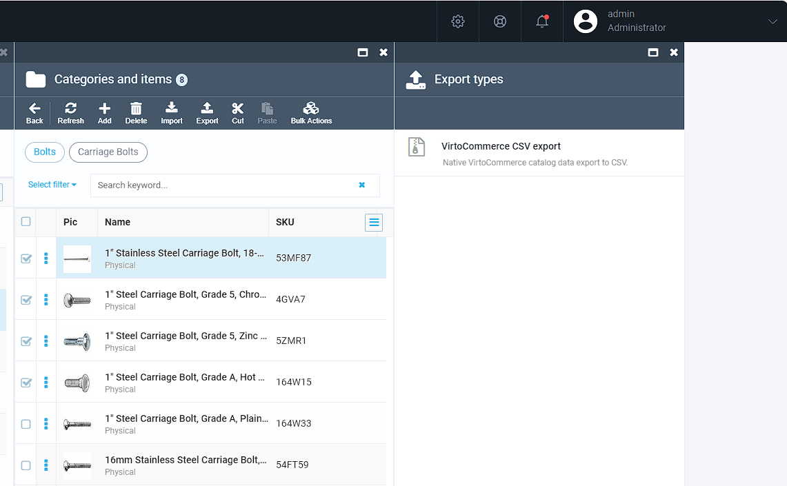
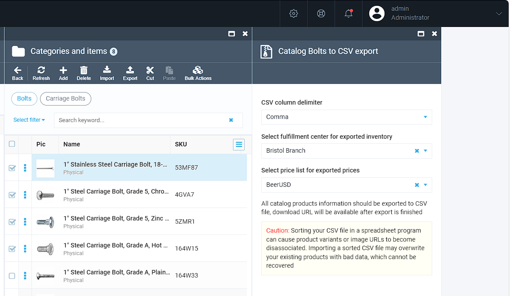
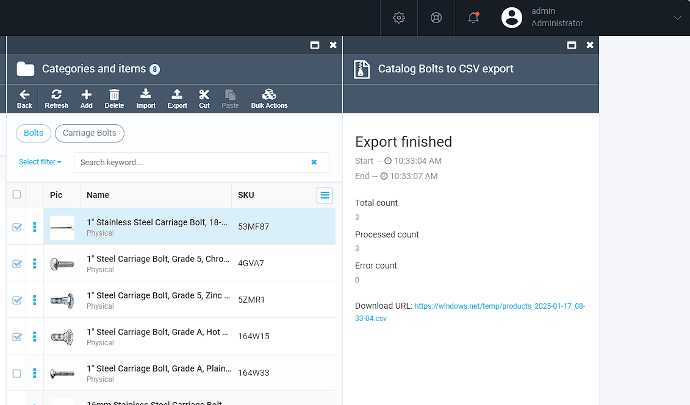
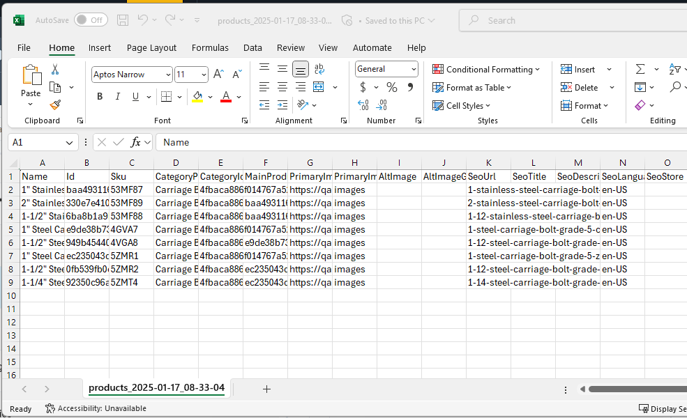
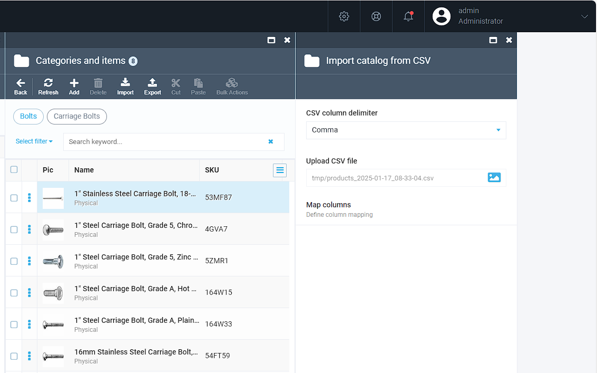
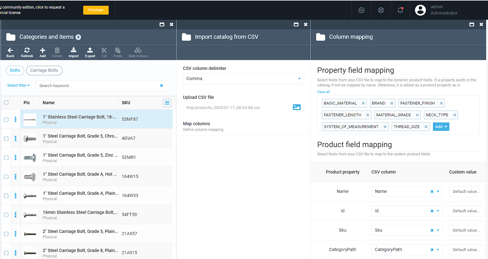
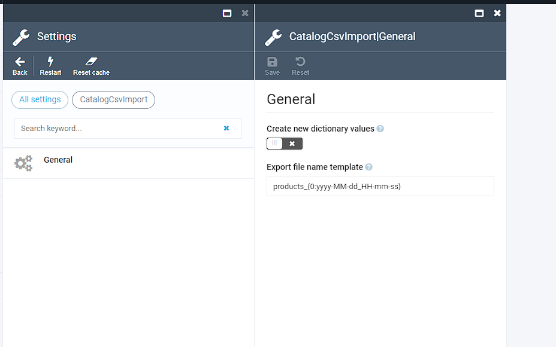

# CSV Catalog Export and Import Module

    

CSV Catalog Export and Import Module is a module for Virto Commerce platform that allows to export and import catalog data in CSV format.

## Overview
The CSV Catalog Export and Import Module facilitates the following capabilities: exporting catalog data to CSV format, 
importing catalog data from CSV format, simplifying bulk operations through export, update, and re-import workflows.

By leveraging this module, category managers can efficiently manage large sets of catalog data and ensure consistency across systems.

## Features
1. Export Catalog Data to CSV: Extract product and category information into CSV format for easy editing and sharing.
1. Import Catalog Data from CSV: Bring updated or new catalog data into the platform from CSV files.
1. Dynamic Properties Support: Export and import dynamic properties seamlessly.
1. Multiple Product Images: Manage image URLs and groups during export and import.
1. Configurable Property Mapping: Define custom mappings for CSV columns during import.
1. Customizable Column Delimiter: Choose a delimiter for CSV files to suit your needs.
1. Create New Dictionary Values: Optionally allow the creation of new dictionary values during import (default: disabled).
1. Bulk Update Ready: Simplify bulk updates by exporting data, modifying it in bulk, and importing the updated data back.

## Scenarios

### Export products

1. Open the Catalog module, select either categories or products and click `Export` button.

2. Select column delimiter, fullfilment center and pricelist and click `Export` button.

3. Wait for the export to complete and download the CSV file.

4. Open CSV file in Excel or any other editor.

### Import products

1. Open the Catalog module, select category and click 'Import' button.

2. Select CSV column delimiter, upload CSV file and click 'Map columns' button.

3. Run the import process.

## Settings

The module includes configurable settings to enhance user control:

* Dictionary Value Creation: Enable or disable the ability to create new dictionary values during import.
* Output File Name: Customize the name of the exported file.

## References
* Home: https://virtocommerce.com
* Documentation: https://docs.virtocommerce.org/platform/user-guide/catalog-csv-export-import/overview/
* Community: https://www.virtocommerce.org
* [Download Latest Release](https://github.com/VirtoCommerce/vc-module-catalog-csv-import/releases)

## License
Copyright (c) Virto Solutions LTD.  All rights reserved.

This software is licensed under the Virto Commerce Open Software License (the "License"); you
may not use this file except in compliance with the License. You may
obtain a copy of the License at http://virtocommerce.com/opensourcelicense.

Unless required by the applicable law or agreed to in written form, the software
distributed under the License is provided on an "AS IS" BASIS,
WITHOUT WARRANTIES OR CONDITIONS OF ANY KIND, either express or
implied.

